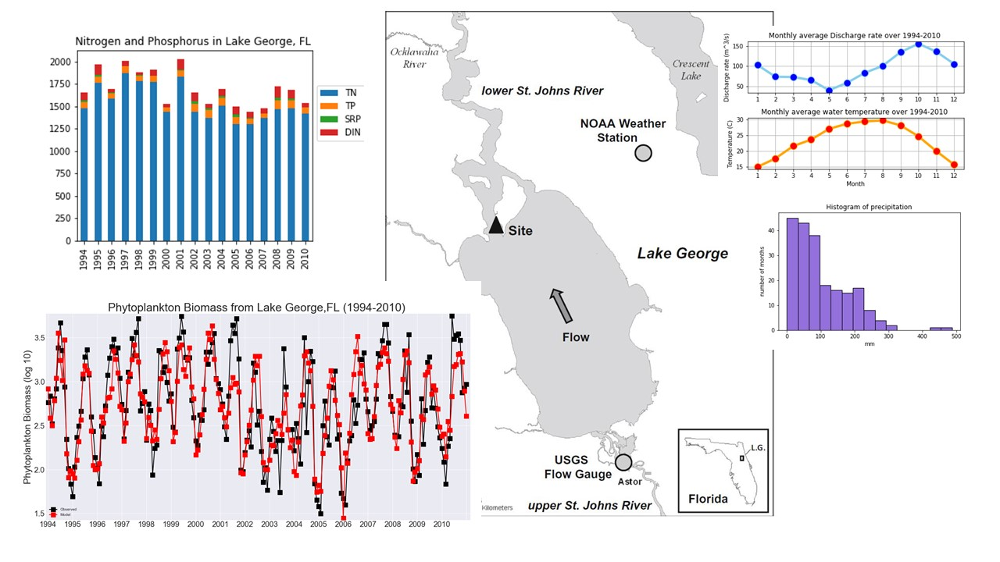

# Freshwater phytoplankton biomass prediction by  using Extreme learning machine at Lake George, Florida

## Abstract
Understanding and predicting dynamic of phytoplankton (algae) population in freshwater lake is important. However, the high complex non-linearity of water variables and their interactions makes it difficult in modeling the population. Recently extreme learning machine (ELM) was reported to have advantages of only requirement of a small number of samples has extremely faster learning speed. In this we proposed ELM based prediction model with inputs from water parameters which include recent data and historical data. In order to enhance the performance of prediction model, we combine the optimization technique to enhance the ability of ELM by using PSO algorithm to find the best parameters. The results reveal that PSO-ELM predictive model showed good prediction and better performance.

## Rename this repository to publish your site

We've already set-up a GitHub Pages website for you, based on your personal username. This repository is called `hello-world`, but you'll rename it to: `username.github.io`, to match your website's URL address. If the first part of the repository doesn’t exactly match your username, it won’t work, so make sure to get it right.

Let's get started! To update this repository’s name, click the `Settings` tab on this page. This will take you to your repository’s settings page. 

